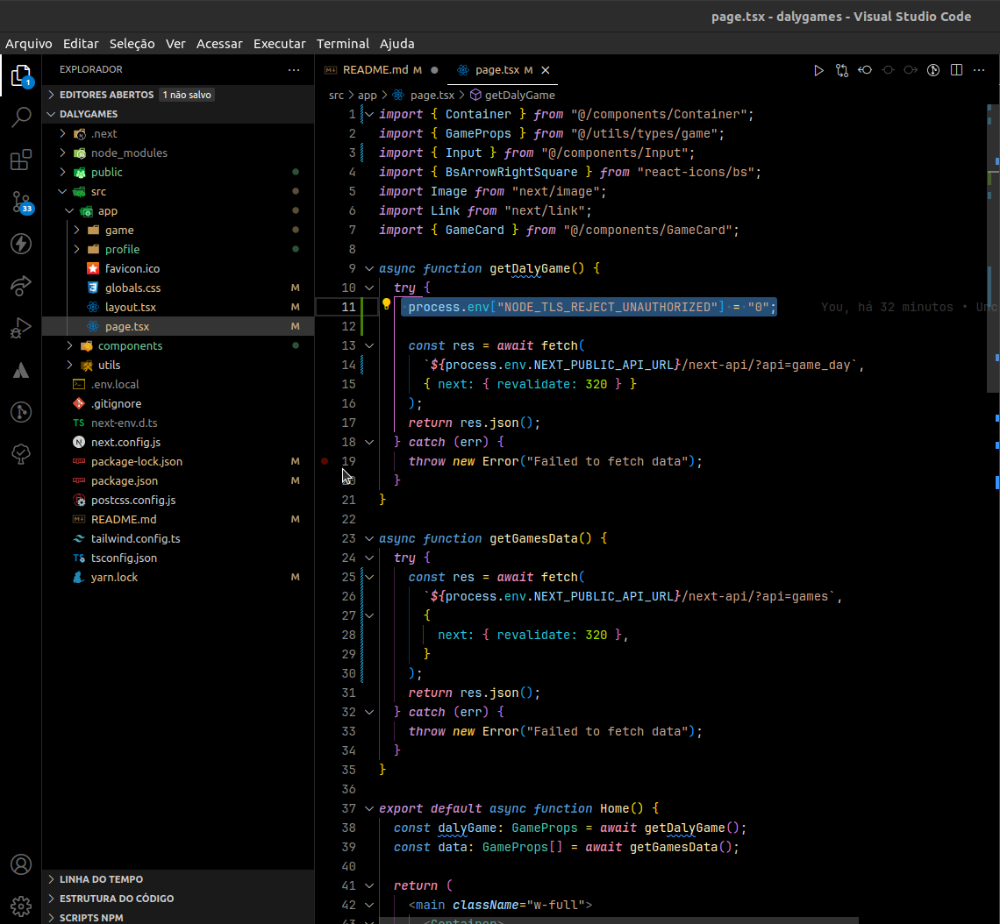
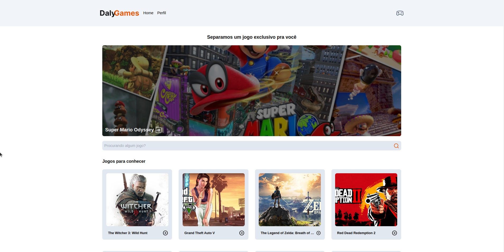
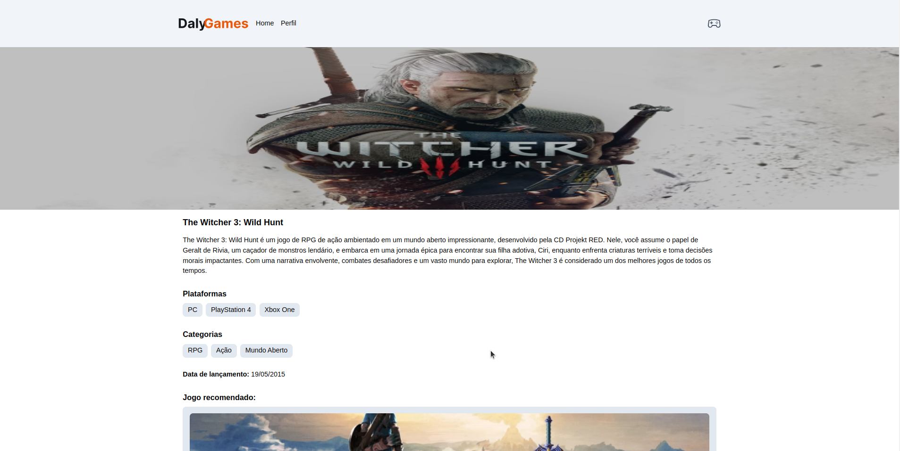
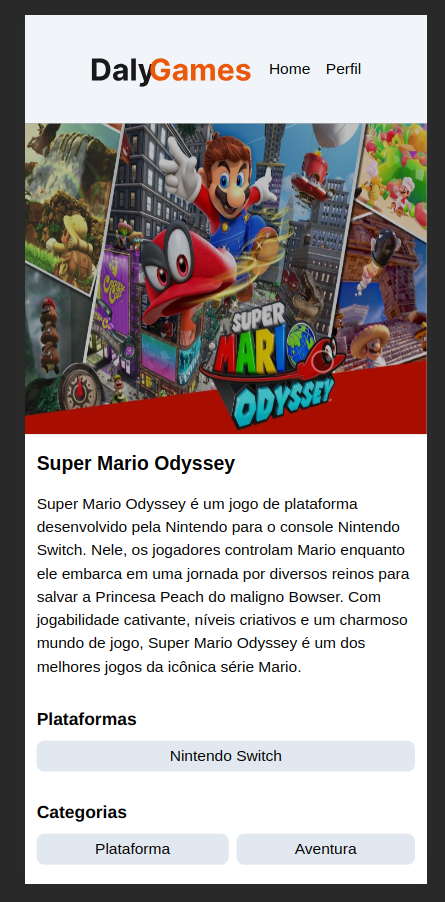

## Sobre ✔️

Projeto desenvolvido no curso de NextJs do Sujeito Programador, utilizando a nova arquitetura do NextJs e consumo de API.

---

## Tecnologias Utilizadas 📎

Esse projeto foi desenvolvido com as seguintes tecnologias:

- [NextJs](https://nextjs.org/docs/getting-started/installation)
- [Tailwind Css](https://tailwindcss.com/docs/installation)
- [Fetch API](https://developer.mozilla.org/en-US/docs/Web/API/Fetch_API/Using_Fetch)
- [React Icons](https://react-icons.github.io/react-icons/)
- [API Sujeito Programador](https://sujeitoprogramador.com/)

---

## Pré-requisitos 📝

Para rodar este projeto é necessário ter instalado na sua máquina as seguintes tecnologias:

- É necessário possuir o [Node.js](https://nodejs.org/en/) instalado na máquina.
- Também, é preciso ter um gerenciador de pacotes seja [Yarn](https://yarnpkg.com/) ou [Npm](https://www.npmjs.com/).

## Observações 🎯

- Criar o arquivo `.env.local` na raiz do projeto com os seguintes códigos:  `export NEXT_PUBLIC_API_URL="https://sujeitoprogramador.com"`
  `export NEXT_PUBLIC_PROJECT_URL="http://localhost:3000"`
- Se estiver utilizando <b>Sistema Operacional Linux Ubuntu</b> deve adicionar a seguinte linha de código: <b>process.env["NODE_TLS_REJECT_UNAUTHORIZED"] = "0";</b> por conta do <a href="https://ajuda.serasa.certificadodigital.com.br/hc/pt-br/articles/4938472757011-Diferen%C3%A7as-entre-os-tipos-de-certificado-SSL#:~:text=Os%20certificados%20SSL%20Self%20Signed,N%C3%A3o%20possuem%20confian%C3%A7a%20p%C3%BAblica.">Certificado de Autoassinado</a>.
  

## Para rodar o projeto 📌

1. Escolher o emulador da sua preferência.
2. Instale as dependências: `yarn`
3. Startar a aplicação: `yarn dev`

## Resultado 📷

    
    

    
     

